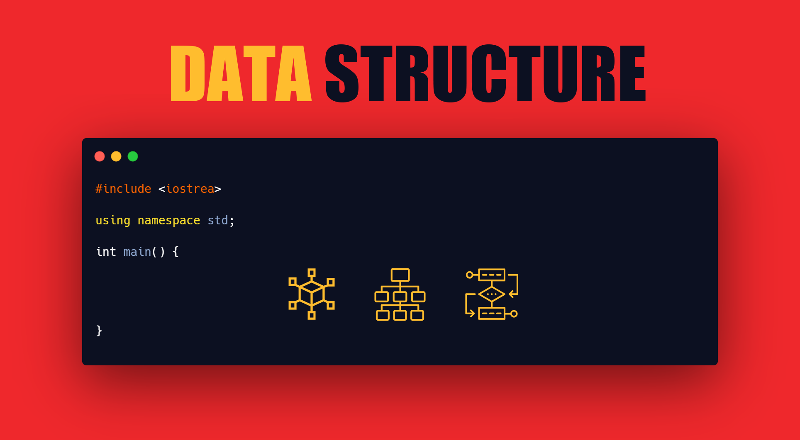

  <h1>DataStructure</h1>

  

 

  :school:<strong>DEVSIGN</strong>에서 <strong>교육</strong>을 위해 작성한 :clipboard:문서입니다.  
  <strong>자료구조</strong>의 전반적인 <strong>이론</strong>에 대해서 교육을 할 것입니다.

## 수업 진행 :book:
- **날짜**
  - 매주 화요일, 목요일날 수업 진행
  - 2시간씩 진행되며 날마다 과제가 주어짐
- **규칙** :memo:
  - 과제를 한번 안 할 경우, 1점 감점
  - 5점 감점 시, 수업에서 강제 퇴출 :cry:
  
## 수업 일정 :date:

- *2021-01-26*
  - Pointer  
  - Function Pointer  
- *2021-01-28*
  - Single Linked List   
  - Circular Single Linked List   
- *2021-02-05*
  - Double Linked List   
  - Circular Double Linked List   
- *2021-02-07*
  - Stack   
  - Queue   
  - Circular Queue   
- *2021-02-12*
  - Binary Search Tree   
- *2021-01-24*
  - Tree traversal   
